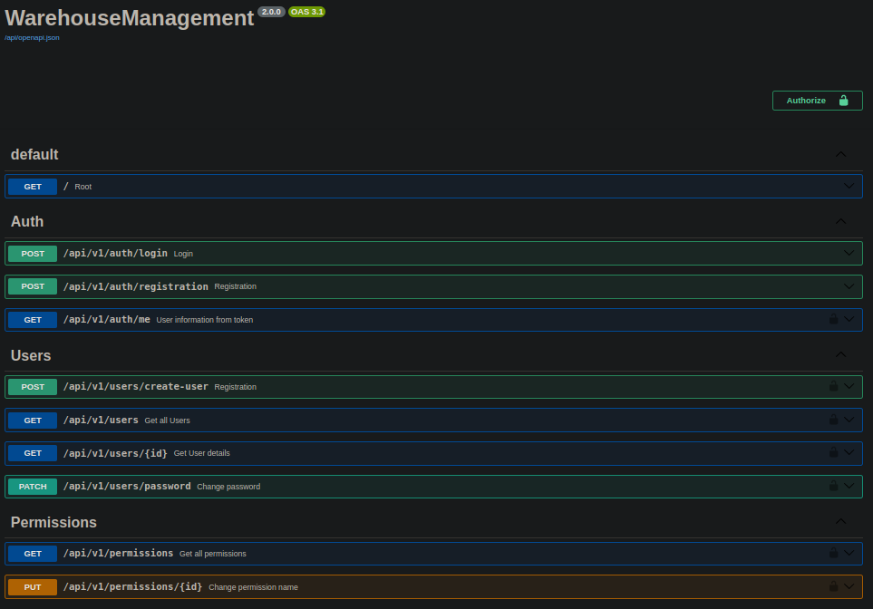
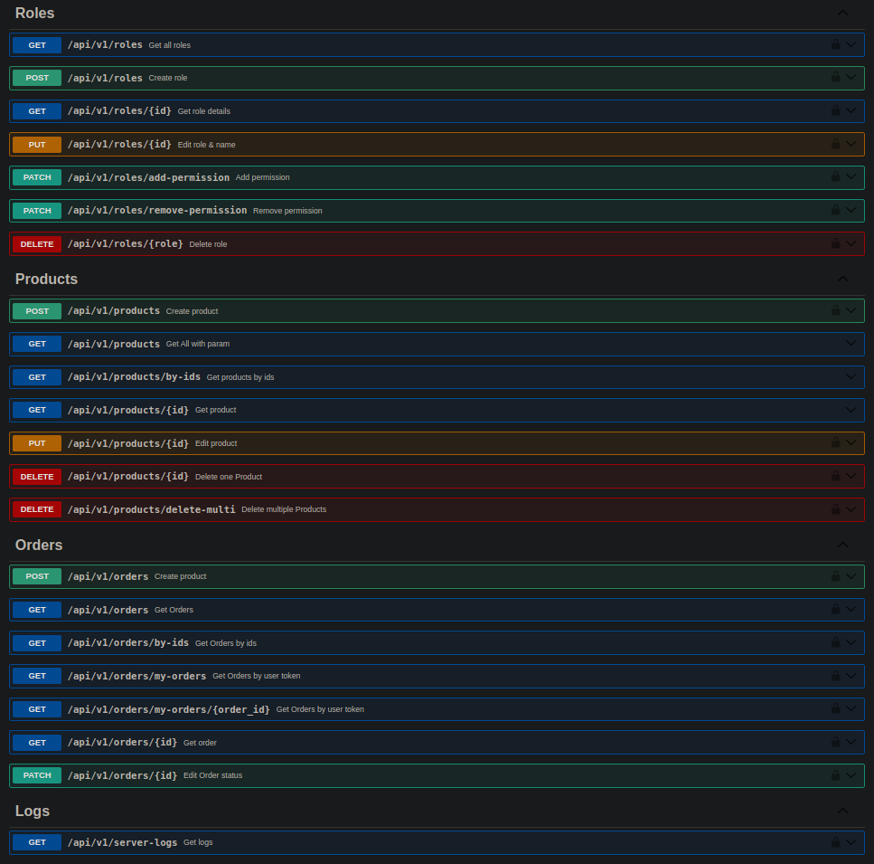

# This is WhereHouse Management system
Written in:
 - API - FastAPI
 - tests - pytest
***
## Installation
**Used:**
 - Python (version 3.11.5)
 - Poetry (version 1.8.3)
***
Step 1: \
Install `poetry` to your system (here official [site](https://python-poetry.org/docs/#installing-with-pipx) )

Step 2:
Go to root directory of project.
 - Run: `poetry shell` - to activate the virtual env
 - Run `poetry install` to install dependencies

Step 3:\
If you want to take advantage of `Taskfile` to install it to your system: \
(if your system is Linux then run just this command: `sudo snap install task --classic`)
or here is official [site](https://taskfile.dev/installation/)\
After installing `Taskfile` you can run `task -l` to list all tasks:
```shell
task: Available tasks for this project:
* clean:                                  Clean caches.
* kill-uvicorn:                           Kill all uvicorn tasks
* run-global:                             Run app globally.
* run-local:                              Run app locally.
* seeder:create-db-down:                  Remove database                                                                                          (aliases: seed:create-db-down)
* seeder:create-db-up:                    Create database                                                                                          (aliases: seed:create-db-up)
* seeder:db-migration-alembic-down:       Migration downgrade using alembic (-1 step from head)                                                    (aliases: seed:db-migration-alembic-down)
* seeder:db-migration-alembic-up:         Migration upgrade using alembic (+1 step from head)                                                      (aliases: seed:db-migration-alembic-up)
* seeder:db-migration-down:               Remove all tables of db using python seeders                                                             (aliases: seed:db-migration-down)
* seeder:db-migration-up:                 Create all tables using python seeders (migrate)                                                         (aliases: seed:db-migration-up)
* seeder:default-roles-down:              Delete 'admin', 'client' roles and their permissions                                                     (aliases: seed:default-roles-down)
* seeder:default-roles-up:                Seed the 'admin', 'client' roles and assign permissions                                                  (aliases: seed:default-roles-up)
* seeder:default-users-down:              Delete 'admin' user(client user for testing purposes)                                                    (aliases: seed:default-users-down)
* seeder:default-users-up:                Seed the default 'admin' user (username=admin, password=admin123)(client user for testing purposes)      (aliases: seed:default-users-up)
* seeder:permissions-down:                Truncate the 'permissions' table of DB                                                                   (aliases: seed:permissions-down)
* seeder:permissions-up:                  Insert initial Data permissions to the 'permissions' table of DB                                         (aliases: seed:permissions-up)
```

***

## Testing
for testing app:
FIRST set `.env` file `ENVIRONMENT=test` \
Run: `pytest` in root directory

***
## Up in docker:
```bash
docker compose up
```
Go: [http://localhost:8000/docs](http://localhost:8000/docs)

***

## About APIs:
 - Create products by user role(roles created by permissions)
 - Accept order by role(permission)
 - When creating an order, check whether there is a sufficient quantity in stock.
<br /><br />


